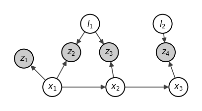
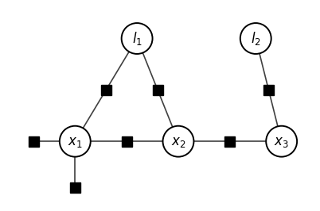

*Reading notes on Dellaert & Kaess, "Factor Graphs for Robot Perception". Source notebook: [`rmath/factor_graphs_dellaert_kaess.ipynb`](https://github.com/cssharsha/rmath/blob/main/factor_graphs_dellaert_kaess.ipynb) — repo not public yet.*


My first exposure to SLAM was EKF and learned about cartographer during
my internship at BNR over the summer. Got to know about GTSAM there
while digging around the calibration stack. <span style="color:#888">I
mainly did the systemic error parameter calibration for the
odometry.</span> And here I was in my third semester digging into factor
graphs when Im supposed to be writing a local planner for topological
maps. This document is mostly my notes during that time latexised and
tied to the micro lie theory notes in the other document that in turn
ties to the ranif library.

This mostly covers the
[Dellart-Kaess](https://www.cs.cmu.edu/~kaess/pub/Dellaert17fnt.pdf)
paper and some references to [Girisetti et
al](http://ais.informatik.uni-freiburg.de/teaching/ws11/robotics2/pdfs/ls-slam-tutorial.pdf)
which is pretty lean but has some good block representations. In the
paper they say can be used for inference problems in robotics and I have
seen them try to push factor graphs for neural nets but have only seen
it been used in state estimation.

## Introduction

Ill skip over a lot of the stuff covered in the initial portion of the
text and provide just a one liner since these are pretty much the base
of any method. Eerything is probabilistic inference and how it is
conveyed across the system.

$p(\mathbf{X}|\mathbf{Z})$ - the conditional densisty that gives the
pose estimates given the measurements and a priori knowledge. Graphical
models provide a way cleaner approach to characterize this which
factorizes the high dimensional probability densities as a product of
mansmaller domain probability density factors.

<span style="color:#888"> They state bayesian networks for generative
modeling and this again is where the use of words leads to so many gaps
in ones knowledge. Why is it *generative*?</span>

Irrespective of what they call it, bayes net in this case is pretty
useful to represent the joint density of the poses and the landmarks and
the measurements observed that connect them. Below is the example
straight out of the paper.




For this example the joint density
$p(\mathbf{X}|\mathbf{Z}) = p(x_1, x_2, x_3, l_1, l_2, z_1, z_2, z_3, z_4)$
which is the product of the conditional densities:

$$\begin{array}{lcl}
p(\mathbf{X}|\mathbf{Z}) & = & p(x_1)p(x_2|x_1)p(x_3|x_2) \\
 & \times &  p(l_1)p(l_2) \\
 & \times &  p(z_1|x_1) \\
 & \times &  p(z_2|x_1,l_1)p(z_3|x_2,l_1)p(z_4|x_3,l_2)
\end{array}$$

The lines differentiate clearly the various kinds of information that is
available and used to setup the joint densities using the conditional
densities of the markov chain on the pose, prior density, conditional
density on the absolute pose, measurement model condition densities.

<span style="color:#888">Ive always wodered if the associations can be
modeled as a distribution itself. I think I remember maybe in optimus
ride where I had encountered a paper that did this. Will have to find it
somewhere </span>

Everything is assumed to be multivariate gaussian distribution for each
of the densities mentioned above. Have additonal processing to mitigate
the non linearity in these models.

<span style="color:#888"> In the introduction there is one section that
is dedicated for simulating from the bayes net model, which makes very
little sense though unless they mean that they are characterizing the
actual environment and behavior using this model.</span> Irrespective of
whether we are “simulating” or modeling the process
<span style="color:#888">or rather the state </span> from a bayes net it
is easier to get the estimate <span style="color:#888"> which they call
as simulate </span> by doing a topological sort and then estimate them
in subsets rather than doing a joint updation on the entire system.

Two important terminologies that feel similar and are very much
intertwined are the posterior and likelihood. From the bayesnet we are
maximizing a posterior to get the unknown variables X i.e. 
$$\begin{array}{lcl}
X^{MAP} & = & \operatorname*{argmax}_{x} p(X|Z) \\
 & = & \operatorname*{argmax}_{x} \frac{p(Z|X)p(X)}{p(Z)}
\end{array}$$
The normalizing factor $p(\mathbf{Z})$ doesnt really matter and it just
boils down to the likelihood of the states X given the measurements Z.
The likelihood is esssentially a function in $X$ with $Z$ as the
parameters. How well conditioned is $X$ tells whther we can find a
solution or not and well conditioned in this sense is how many
parameters of $Z$ provide good constraints on $X$

This demarcation between the measurements and the states calls for a
different graphical model and these guys <span style="color:#888"> at
least thats what I think </span> introduce factor graphs.
<span style="color:#888"> since I havent specifically seen the modeling
portion using bayes net, Ive only used filtering using EKF or factor
graphs so I specifically havent used bayes nets, which is now worth
exploring atleast to take a look at how they are actually used. </span>

The above bayes net becomes the following MAP equation for the toy
example:

$$\begin{array}{lcl}
p(X|Z) & \propto & p(x_1)p(x_2|x_1)p(x_3|x_2) \\
 & \times &  p(l_1)p(l_2) \\
 & \times &  l(x_1;z_1) \\
 & \times &  l(x_1,l_1;z_2)l(x_2,l_1;z_3)l(x_3,l_2;z_4)
\end{array}$$




Note that there is an additional node associated with $x_1$ and there is
a specific node connecting the conditional density between each state
nodes as well. <span style="color:#888"> The paper states that unlike in
bayes net there is no explicit measurement node specified, but rather
than an explicit measurement node there are additional explicit nodes
representing this information and even the implied markov chains that
are represented by the edges are spelled out using factor nodes
connecting those state nodes. </span>

As a formal definition factor graph is a bipartate graph $F= (U, V, E)$
with two types of nodes: **factors** $\phi \in U$ and **variables**
$x_j \in V$. Edges $e_{ij} \in E$ are between factors and variable
nodes. And then theres one set which has all the variable nodes adjecent
to a factor $\phi_i$ that is written as $N(\phi_i)$ and that is written
as $X_i$. Factor graph $F$ defines the factorization of a global
function $\phi(X)$ as

$$\phi (X) = \prod_{I}\phi_i(X_i)$$

Each of the constraints are independent condition desnsities. These are
provided by the edges $e_{ij}$ with the factor $\phi_i$ containing only
the variables $X_i$ that are in the adjacency set $\mathcal{N}(\phi_i)$

Converting bayes net to factor graph: 1. every bayes net node splits
into both the variable node and the factor node. 2. factor node is
connected to variable node from which it was extracted from along with
the parent node that this associated to. 3. If some nodes are
measurement <span style="color:#888">evidence</span> node then they just
become parameters in the factor node.

The final form of the toy example in correct factor graph factorization:

$$\begin{array}{lcl}
\phi(l_1, l_2, x_1, x_2, x_3) & = & \phi(x_1)\phi(x_2,x_1)\phi(x_3,x_2) \\
 & \times & \phi_4(l_1)\phi_5(l_2) \\
 & \times & \phi_6(x_1) \\
 & \times & \phi_7(x_1,l_1)\phi_8(x_2,l_1)\phi_9(x_3,l_2)
\end{array}$$

Some comments in this section worth mentioning: 1. Evaluating this
function is easy once the factor graph is properly generated. 2. Easier
to work in log or negative log space
<span style="color:#888">obviously</span>. 3. All gradient agnostic
methods can be used to optimize <span style="color:#888">da we have a
cost function to optimize</span> 4. a. Much easier if it is continuous
and gradient based methods can make it quick. b. discrete variables -
graph search methods which are expensive 5. Generally its always a
mixture of the two

<span style="color:#888"> Have to define the variants somewhere and
represent them as factor graphs and then apply it. My theoritical
curiosity(which is only a curiosity and hasnt got anywhere).

Have to checkout Gibbs sampling, have never used it anywhere. </span>

## Smoothing and Mapping

Given that we have a number of factors that are mostly non-linear the
objective of SLAM is to find the values that maximally agree to the
constraints these factors or rather the uncertain measurements which are
called as factors define. <span style="color:#888">not spelling out each
and every specific thing out here. </span>

MAP inference:

We had
$$\begin{array}{lcl}
X^{MAP} & = & \operatorname*{argmax}_{X} \phi(X) \\
 & = & \operatorname*{argmax}_{X} \prod_{i} \phi_i(X_i)
\end{array}$$

Assuming that all the factors are gaussians with zero mean noise

$$\phi_i(X_i) \propto \text{exp}\{-\frac{1}{2} \lVert h_i(X_i) - z_i \rVert_{\Sigma_i}^2\}$$

*Contains both the gaussian priors and likelihood factors*.

Changing to negatve log space and dropping the constant finding the MAP
becomes a minimization problem of the following:

$$X^{MAP} = \operatorname*{argmin}_{X} \lVert h_i(X_i) - z_i \rVert_{\Sigma_i}^2$$

Often as is the case of the sensors we have the measurements are
normally of a lower dimension than the unnown $X_i$ we are computing and
naturally there are a lot more solutions that satisfy the constraint. So
we need multiple measurements adding to the constraints in order to
extract a unique solution of the variables.

The crux of everything now is, since $h_i$ is non linear we would need a
good initial estimate and from there non-linear optimizations like
Gauss-Newton and LM can be applied. Any non linear optimization is just
iteratively reducing the cost by linearizing and moving towards tha
global minimum.

Taylor’s expansion, here it comes. Linearizing $h(\cdot)$ in the least
quares objective function:

$$h_i(X_i) = h_i(X^0_i + \Delta_i) \approx h_i(X^0_i) + H_i\Delta_i$$

and the measurement jacobian $H_i$ is the multivariate partial
derivative of $h_i$ at a given linearization point $X^0_i$,
$$H_i \defeq \left. \frac{\partial h_i(X_i)}{\partial X_i} \right|_{X^0_i}$$

and $\Delta_i \defeq X_i - X^0_i$ is the **state update vector**.
Relating these to the Lie group treatment, $H_i$ is essentially the
tangent space at the measurement point which is ${}^X\tau$ when the
state space is a manifold.

Now substituting the linearization in the cost function:
$$\begin{array}{lcl}
\Delta^* & = & \operatorname*{argmin}_{\Delta} \lVert h_i(X^0_i) + H_i\Delta_i - z_i \rVert_{\Sigma_i}^2 \\
 & = & \operatorname*{argmin}_{\Delta} \lVert  H_i\Delta_i - (z_i - h_i(X^0_i)) \rVert_{\Sigma_i}^2
\end{array}$$

where $z_i - h_i(X^0_i)$ is the **prediction error** at the
linearization point. <span style="color:#888"> Note the clean tying to
bayes filters</span>

The scaling of the entire error function can be re-written by changing
the variables.
$$\lVert e \rVert_{\Sigma_i}^2 \defeq \lVert \Sigma^{-1/2}e \rVert_{2}^2$$

and substituting the error function:

$$\begin{array}{lcl}
A_i & = & \Sigma^{-1/2}H_i \\
b_i & = & \Sigma^{-1/2}(z_i - h_i(X^0_i))
\end{array}$$

This is called whitening which eliminates the units all together as well
and allows for different kinds of measurements to contribute to the cost
function.

Final form:

$$\begin{array}{lcl}
\Delta^* & = & \operatorname*{argmin}_{\Delta} \sum_i \lVert A_i\Delta_i - b_i \rVert_{2}^2 \\
 & = & \operatorname*{argmin}_{\Delta} \lVert A\Delta - b \rVert_{2}^2
\end{array}$$

Once this least squares function is established its a number of
different factorizations to solve for $\Delta^*$ which is full rank
$m \times n$ matrix $A$ with $m \geq n$.

- Cholesky: positive definite, factored using the information matrix
  $\Lambda \defeq A^\top A = R^\top R$
- QR: more accurate, more stable, directly factorizes $A$. Slower than
  cholesky.

One big thing to notes is sparsity which allows for some better tricks
to use.

Optimization algorithms: - Stepest descent - direction of the jacobian -
Guass-Newton - direction of the hessian - LM - alternate between
jacobian and hessian - Dogleg method - pre-compute both and use
whichever is valid in that step

## Sparsity

Not everything is connected to everything so the jacobian matrix A that
is setup is actually very sparse that allows for some tricks that help
in reducing the complexity of the factorizations required to find the
$\Delta$ in each step of the optimization.

Refering back to the factors in the equation for the toy example
$$\begin{array}{lcl}
\phi(l_1, l_2, x_1, x_2, x_3) & = & \phi(x_1)\phi(x_2,x_1)\phi(x_3,x_2) \\
 & \times & \phi_4(l_1)\phi_5(l_2) \\
 & \times & \phi_6(x_1) \\
 & \times & \phi_7(x_1,l_1)\phi_8(x_2,l_1)\phi_9(x_3,l_2)
\end{array}$$

the block structure of the sparse jacobian is

$$  [A|b] =
  \begin{array}{cc}
      & \begin{array}{cccccc} \partial l_1 & \partial l_2 & \partial x_1 & \partial x_2 & \partial x_3 & b \end{array} \\[2pt]
    \begin{array}{c} \phi_1 \\ \phi_2 \\ \phi_3 \\ \phi_4 \\ \phi_5 \\ \phi_6 \\ \phi_7 \\ \phi_8 \\ \phi_9 \end{array}
      &
    \left[\begin{array}{ccccc|c}
       & & A_{13} & & &  b_1\\
        & & A_{23} & A_{24} & & b_2\\
         & & & A_{34} & A_{35} & b_3\\
         A_{41} & & & & & b_4\\
           & A_{52} & & & & b_5\\
            & & A_{63} & & & b_6\\
            A_{71} & & A_{73} & & & b_7\\
             A_{81} & & & A_{84} & & b_8\\
               & A_{92} & & & A_{95} & b_9\\
    \end{array}\right]
    \end{array}
  $$

The information matrix $\Lambda = A^\top A$ is what Cholesky actually
factors. Writing it down by hand below:

$$  A^{\!\top}\!A=
  \begin{bmatrix}
  A_{41}^2{+}A_{71}^2{+}A_{81}^2 & 0 & A_{71}A_{73} & A_{81}A_{84} & 0 \\
  0 & A_{52}^2{+}A_{92}^2 & 0 & 0 & A_{92}A_{95} \\
  A_{71}A_{73} & 0 & A_{13}^2{+}A_{23}^2{+}A_{63}^2{+}A_{73}^2 & A_{23}A_{24} & 0 \\
  A_{81}A_{84} & 0 & A_{23}A_{24} & A_{24}^2{+}A_{34}^2{+}A_{84}^2 & A_{34}A_{35} \\
  0 & A_{92}A_{95} & 0 & A_{34}A_{35} & A_{35}^2{+}A_{95}^2
  \end{bmatrix}
  $$

<span style="color:#888">Asked claude to write it in SymPy which I found
out about. Pretty neat imho</span>

``` python

import sympy as sp

cols = ['l1', 'l2', 'x1', 'x2', 'x3']

# the sparsity spec straight from [A|b]: (row, col) pairs that carry a nonzero A_ij.
# rows are the factors phi_1..phi_9 (1-indexed), cols are 1..5 as above.
nz = [(1, 3), (2, 3), (2, 4), (3, 4), (3, 5),
      (4, 1), (5, 2), (6, 3),
      (7, 1), (7, 3), (8, 1), (8, 4), (9, 2), (9, 5)]

# build A as a 9x5 matrix: each nonzero is its own symbol A_{ij}, everything else 0.
A = sp.zeros(9, 5)
for (i, j) in nz:
    A[i - 1, j - 1] = sp.Symbol(f'A{i}{j}')   # A.row/col are 0-indexed, symbol name keeps 1-index

Lambda = sp.simplify(A.T * A)   # the 5x5 information matrix  A^T A

# pretty-print with the variable names on the axes
sp.Matrix(Lambda)
```

$\displaystyle \left[\begin{matrix}A_{41}^{2} + A_{71}^{2} + A_{81}^{2} & 0 & A_{71} A_{73} & A_{81} A_{84} & 0\\0 & A_{52}^{2} + A_{92}^{2} & 0 & 0 & A_{92} A_{95}\\A_{71} A_{73} & 0 & A_{13}^{2} + A_{23}^{2} + A_{63}^{2} + A_{73}^{2} & A_{23} A_{24} & 0\\A_{81} A_{84} & 0 & A_{23} A_{24} & A_{24}^{2} + A_{34}^{2} + A_{84}^{2} & A_{34} A_{35}\\0 & A_{92} A_{95} & 0 & A_{34} A_{35} & A_{35}^{2} + A_{95}^{2}\end{matrix}\right]$

Rewriting the above as just the information matrix symbols:

$$\begin{bmatrix}
\Lambda_{11} & & \Lambda_{13} & \Lambda_{14} & \\
 & \Lambda_{22} & & \Lambda_{25} \\
\Lambda_{31} & & \Lambda_{33} & \Lambda_{34} & \\
\Lambda_{41} & & \Lambda_{43} & \Lambda_{44} & \Lambda_{45} \\
 & \Lambda_{52} & & \Lambda_{54} & \Lambda_{55}
\end{bmatrix}$$

This is exactly of the form that one would get when the SLAM toy example
is represented using yet another graphical model MRF. The hessian
$\Lambda = A^{\top}A$ and the adjacency matrix $G$ of an MRF are one and
the same. <span style="color:#888">I had always viewed MRF in a
different light and this links even factor graphs and MRF in
SLAM.</span>

The authors mention a different route in which
$\lVert A\Delta - b \rVert_2^2$ is expanded and this gives rise to a
different form that is directly linked to the densities induced by
binary MRFs. <span style="color:#888">That portion introduces yet
another set of symbols that Im particulary not amused by and am just
skipping it altogether</span>
